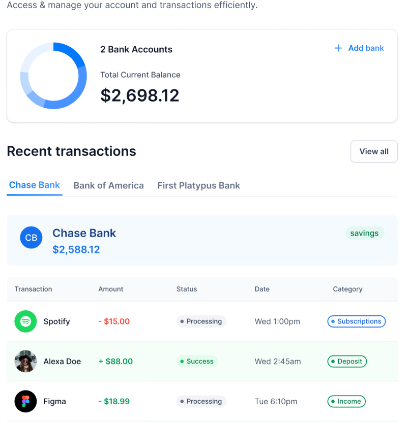
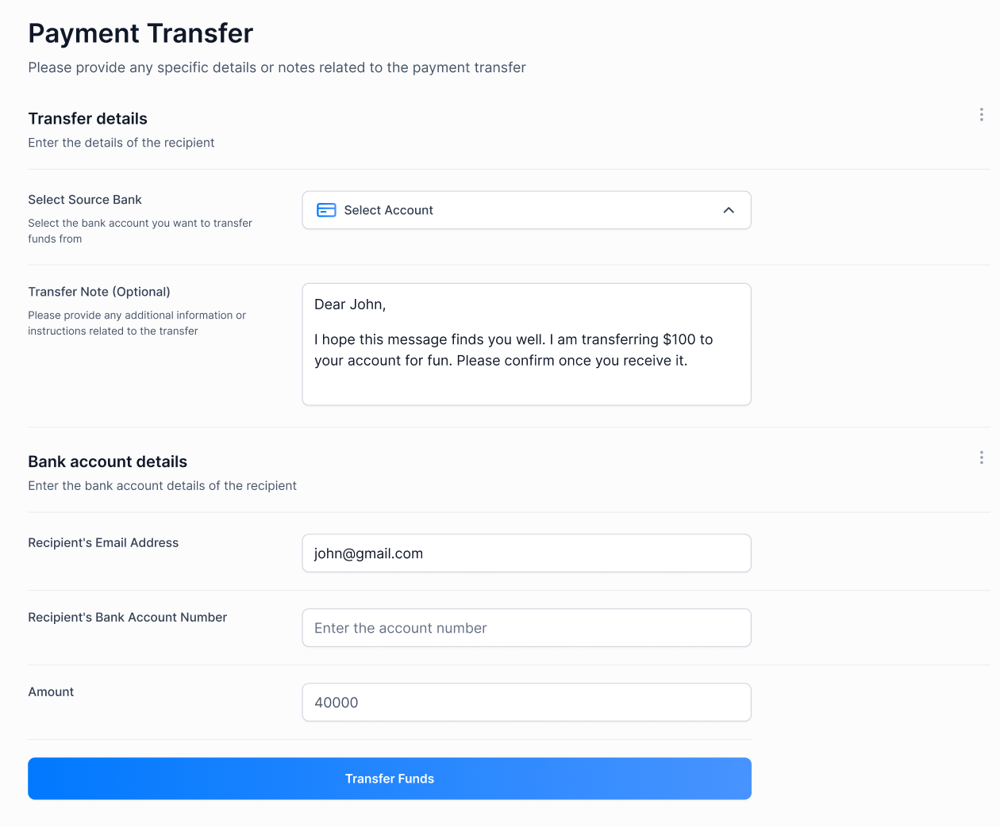
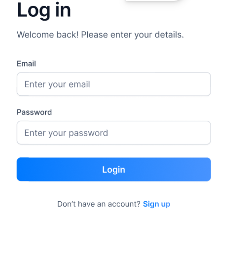

Banking & Finance Dashboard

A Full-stack banking web app built with **Next.js 14**. It lets users connect multiple real bank accounts, view balances and transactions in one dashboard, and transfer money to other users on the platform.

> Built by following the [JavaScript Mastery](https://www.youtube.com/@javascriptmastery) tutorial *"Build and Deploy a Banking App with Finance Management Dashboard Using Next.js 14."*


---

## Screenshots

<!-- Replace the paths below with your own images (e.g. put them in a /screenshots folder) -->

| Dashboard | 
| --- | --- |
|  |

| Payment Transfer | Log In |
| --- | --- |
|  |  |

##  Features

- **Authentication** — Secure sign-up and sign-in with server-side sessions (Appwrite)
- **Connect banks** — Link real bank accounts through Plaid
- **Dashboard** — Total balance across all accounts, a doughnut chart breakdown, and recent transactions
- **My Banks** — See every connected account with its balance and details
- **Transaction History** — Paginated transactions per account, with categories and status
- **Payment Transfers** — Send funds to another user on the platform via Dwolla
- **Responsive design** — Works on desktop, tablet, and mobile

##  Tech Stack

| Area | Tools |
| --- | --- |
| Framework | Next.js 14 (App Router, Server Actions), React, TypeScript |
| Styling / UI | Tailwind CSS, shadcn/ui |
| Backend & Auth | Appwrite |
| Banking APIs | Plaid (account linking & data), Dwolla (transfers) |
| Forms & Validation | React Hook Form, Zod |
| Charts | Chart.js, react-chartjs-2 |


##  Getting Started

```

###  Set up environment variables

Create a `.env` file in the project root and add:

```env
# NEXT
NEXT_PUBLIC_SITE_URL=http://localhost:3000

# APPWRITE
NEXT_PUBLIC_APPWRITE_ENDPOINT=https://cloud.appwrite.io/v1
NEXT_PUBLIC_APPWRITE_PROJECT=
APPWRITE_DATABASE_ID=
APPWRITE_USER_COLLECTION_ID=
APPWRITE_BANK_COLLECTION_ID=
APPWRITE_TRANSACTION_COLLECTION_ID=
NEXT_APPWRITE_KEY=

# PLAID
PLAID_CLIENT_ID=
PLAID_SECRET=
PLAID_ENV=sandbox
PLAID_PRODUCTS=auth,transactions,identity
PLAID_COUNTRY_CODES=US,CA

# DWOLLA
DWOLLA_KEY=
DWOLLA_SECRET=
DWOLLA_BASE_URL=https://api-sandbox.dwolla.com
DWOLLA_ENV=sandbox
```

Fill in the values from your Appwrite, Plaid, and Dwolla dashboards. **Never commit your `.env` file** — it's already listed in `.gitignore`.


## Project Structure

```
├── app/                # Routes: (auth) sign-in/sign-up, (root) dashboard pages
├── components/         # Reusable UI components (sidebar, charts, forms, etc.)
├── constants/          # Static data like nav links
├── lib/
│   ├── actions/        # Server actions for users, banks, transactions, Dwolla
│   ├── appwrite.ts     # Appwrite client setup
│   ├── plaid.ts        # Plaid client setup
│   └── utils.ts        # Helper functions
├── public/             # Icons and images
└── types/              # TypeScript type definitions
```


##  Disclaimer

This is a learning project running on sandbox APIs. I do not recommend using it with real banking credentials.
